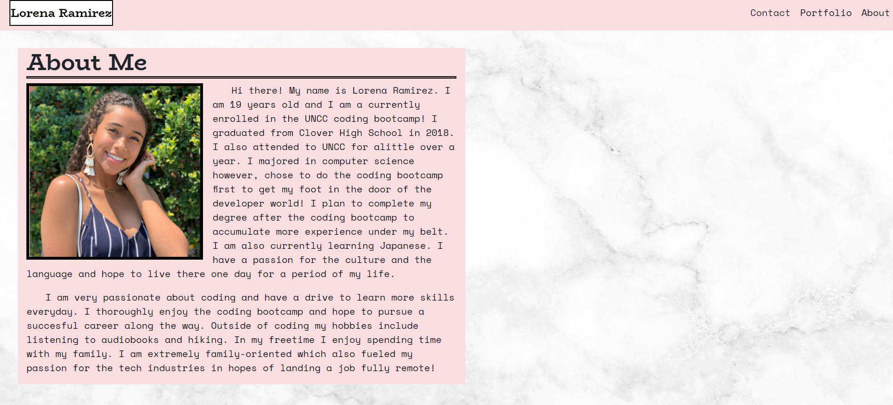
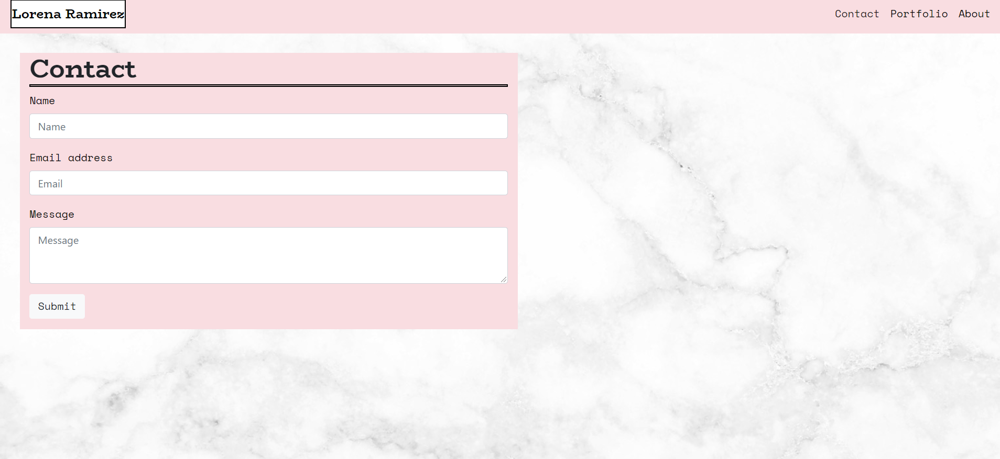
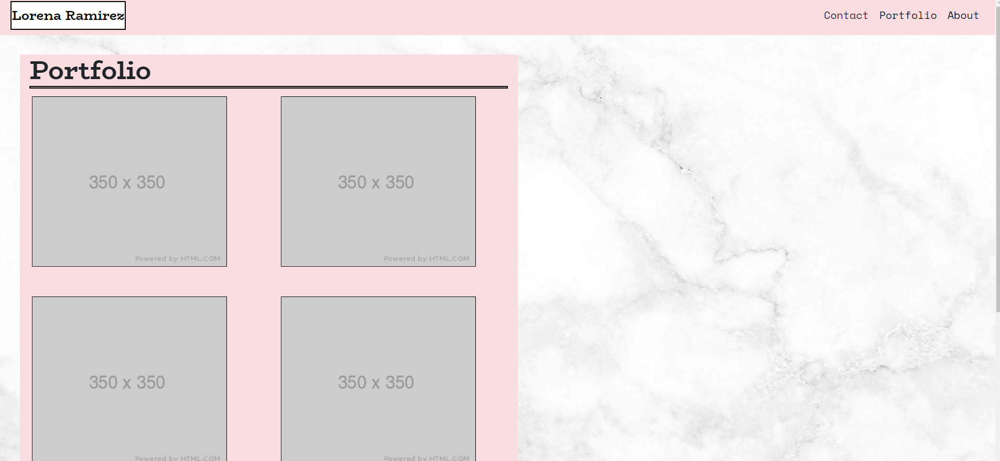

# Portfolio
This website is a portfolio for Lorena Ramirez.

## Main Purpose

 *   This project was orginially built to help practice and experiment with using boostrap to create a website. My goal was to replicate a website as close as possible using the tools bootstrap provided. The goal was to effectively make the layout mobile responsive to ensure accesability across all playforms.
 *  The project doubles as a portfolio allowing me to showcase my work as well as provie alittle more information about myself.
*   I learned more about grid layouts and how to efficiently read through and process documentation. I was also able to add my creative style to the project by experimenting with CSS and customizing the website to my liking.

### Link
[Lorena Ramirez Portfolio](https://lorena-ramirez.github.io/Portfolio/)

*Home Page*

*Contact Page*

*Portfolio Page*

